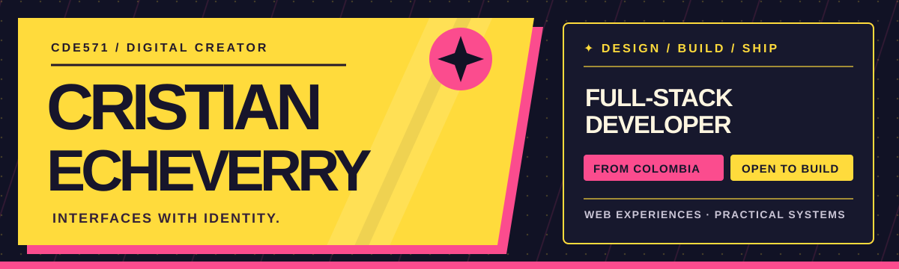

  

**I build digital products with a clear identity, useful interactions, and solid foundations.**

 

---

## ✦ ABOUT

I'm **Cristian Echeverry**, a full-stack developer from Colombia. I design and build web experiences that are visually distinctive and straightforward to use. I work across interface design, frontend architecture, backend APIs, and the details that bring a product together.

I like bold visual systems, considered motion, readable code, and practical tools that solve real problems.

## ✦ FEATURED WORLD — LEYENDAS

**[Leyendas Wallpapers](https://leyendas-wallpapers.vercel.app/)** is a poster-inspired gallery of 174 illustrated desktop backgrounds. It includes search, full-screen previews, animation prompts, downloads, and a Windows app for applying wallpapers directly.

[Explore the gallery ↗](https://leyendas-wallpapers.vercel.app/) · [View the code ↗](https://github.com/Cde571/leyendas-wallpapers) · [Download the app ↗](https://github.com/Cde571/leyendas-wallpapers/releases/latest)

## ✦ MORE SELECTED WORK

| Project | What I built | Explore |
| --- | --- | --- |
| **Arcade Portfolio** | A searchable personal portfolio with a playful arcade-inspired visual system. | [Live ↗](https://portfolio-dev-j8vo.vercel.app/) · [Code ↗](https://github.com/Cde571/portfolio.dev) |
| **FoodEmotions** | A food experience that explores emotion-aware content and interactive recipe guidance. | [Frontend ↗](https://github.com/Cde571/food-emotions) · [Backend ↗](https://github.com/Cde571/foodemotions--back) |
| **Smart CCTV Management** | Camera maps, monitoring views, reports, and operational workflows. | [Code ↗](https://github.com/Cde571/cameras-security) |
| **World Cup 2026 Predictions** | Football predictions with team views, rankings, scores, and a dedicated API. | [Frontend ↗](https://github.com/Cde571/WordCup2026-frontend) · [Backend ↗](https://github.com/Cde571/API-BACKEND-WORDCUP) |
| **BankApp** | A banking interface exploring account and transaction flows. | [Code ↗](https://github.com/Cde571/bankapp) |

<b>More experiments — vision, 3D, machine learning, and systems</b>

 

| Project | Focus | Code |
| --- | --- | --- |
| ML Substitute Project | Data pipelines, training, and evaluation | [Repository ↗](https://github.com/Cde571/proyecto_sustituto) |
| TecoGAN | Video super-resolution | [Repository ↗](https://github.com/Cde571/TecoGAN) |
| CNN-RED | Convolutional neural network experiments | [Repository ↗](https://github.com/Cde571/CNN-RED) |
| Color Detector | Real-time color detection with OpenCV | [Repository ↗](https://github.com/Cde571/detector_colores) |
| Vehicle Detector | Vehicle detection pipeline | [Repository ↗](https://github.com/Cde571/detector_carroz) |
| Flappy ML | A machine-learning game agent | [Repository ↗](https://github.com/Cde571/flappy_ml) |
| Background Remover | Image background removal | [Repository ↗](https://github.com/Cde571/rembg-image) |
| Solar System 3D | Interactive 3D solar system | [Repository ↗](https://github.com/Cde571/SistemaSolar3D) |
| SIGED | Document and records management | [Repository ↗](https://github.com/Cde571/SIGED) |
| Threads & Processes | Operating-systems coursework | [Threads ↗](https://github.com/Cde571/Practica_Hilos) · [Processes ↗](https://github.com/Cde571/Pr-ctica-No.-2-API-de-Procesos-) |
| Stream Fighter | Educational fighting game | [Repository ↗](https://github.com/Cde571/stream_fighter_educativo) |

[Browse all repositories ↗](https://github.com/Cde571?tab=repositories)

## ✦ TOOLBOX

| Area | Tools |
| --- | --- |
| **Interfaces** | Astro · React · TypeScript · JavaScript · CSS |
| **Services** | Node.js · REST APIs · MongoDB |
| **Creative work** | Figma · motion · visual systems |
| **Experiments** | Python · OpenCV · machine learning |
| **Delivery** | Git · Docker · Vercel |

## ✦ LET'S BUILD SOMETHING

I’m open to frontend and full-stack work, freelance projects, and collaborations where the product and its visual identity matter.

[Portfolio ↗](https://portfolio-dev-j8vo.vercel.app/) · [Email ↗](mailto:cristian.echeverry1@udea.edu.co) · [YouTube ↗](https://youtube.com/cdecp) · [GitHub activity ↗](https://github.com/Cde571?tab=overview)

---

  DESIGN WITH CHARACTER ✦ BUILD WITH PURPOSE

